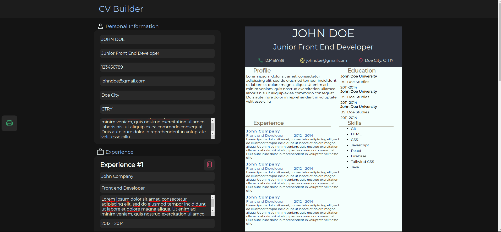
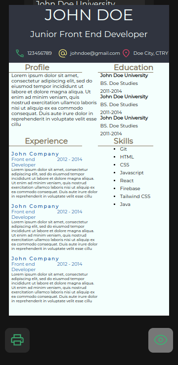

# cv-creator

This is a project part of [The Odin Project](https://www.theodinproject.com)
It enables to create a resume using a ready template. The template with filled in data can then be downloaded in pdf format.

## Features

1. Shows information on template on user input.
2. Uses ready template so user does not worry about design.
3. Filled out template can be downloaded in pdf format.

## Demo

The live demo of the project can be viewed live [here](https://mickfrog.github.io/cv-creator)

## Preview

### Desktop Preview

### Mobile Preview

# Getting Started

1. Clone the repository to your local machine.
2. navigate to containing folder i.e. cv-creator
3. run this line to install necessary dependencies,
   `npm install`
4. Finally, run this line to run the project on a live server from your local network.
   `npm start`

## Built with

1. [React](https://react.dev/)
2. [uniqid](https://www.npmjs.com/package/uniqid)
3. [react-to-print](https://www.npmjs.com/package/react-to-print)

[MickFrog](https://www.github.com/MickFrog)
